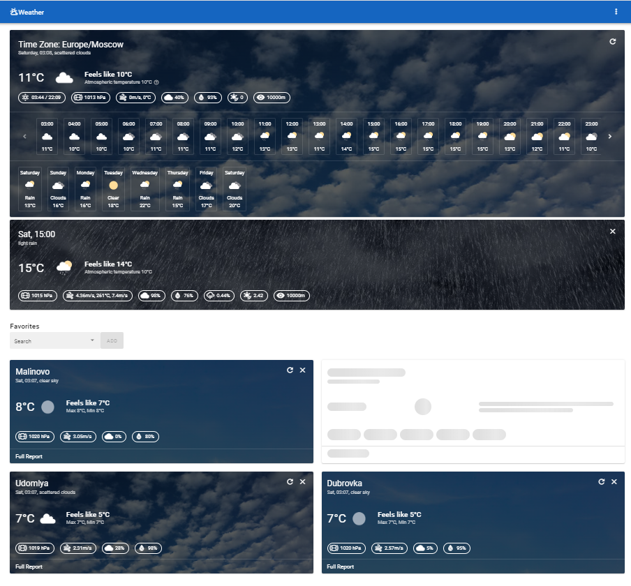

<div id="top"></div>

<!-- PROJECT LOGO -->
<br />
<div align="center">
  <h3 align="center">Weather</h3>
  <p align="center">
    🌥️❄️ App showing the weather by geolocation and for other cities of Russia with adding them to favorites
    <br />
    <br />
    <a href="https://oleinikovapolina.github.io/Weather/dist/#/">View Demo</a>
  </p>
</div>


<!-- TABLE OF CONTENTS -->
<details>
  <summary>Table of Contents</summary>
  <ol>
    <li><a href="#features">Features</a></li>
    <li><a href="#built-with">Built With</a></li>
    <li><a href="#project-setup">Project setup</a></li>
  </ol>
</details>

<br/>



<!-- FEATURES -->
<h2 id="features">✨ Features</h2>

* weather display by geolocation or by a selected city in the settings
* weather search for Russian cities, adding them to favorites
* complete weather report with the ability to view details by hour or day
* update information button
* skeleton loading
* tooltips with information description
* changing units
* different images for the weather
* pwa


<p align="right">(<a href="#top">back to top</a>)</p>

<!-- BUILT WITH -->
<h2 id="built-with">🏗️ Built With</h2>

* Vue
* Vuex
* Vue-router
* Vuetify
* Axios
* Moment
* Pwa

<p align="right">(<a href="#top">back to top</a>)</p>

<!-- PROJECT SETUP -->
<h2 id="project-setup">⚙️ Project setup</h2>

```
npm install
```

### Compiles and hot-reloads for development

```
npm run serve
```

### Compiles and minifies for production

```
npm run build
```

### Lints and fixes files

```
npm run lint
```

### Customize configuration

See [Configuration Reference](https://cli.vuejs.org/config/).

<p align="right">(<a href="#top">back to top</a>)</p>
